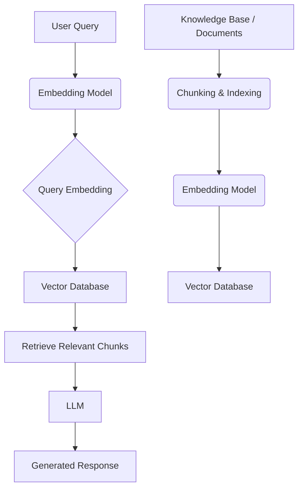
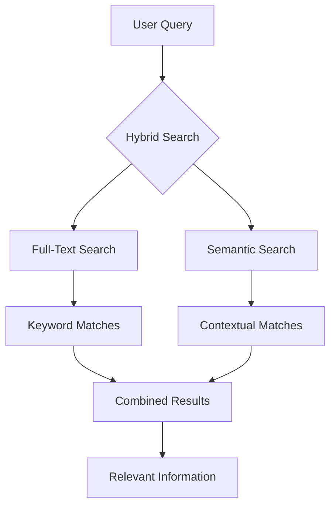

## Vector Databases and RAG: The Engine Behind Intelligent Local AI

In the rapidly evolving landscape of Artificial Intelligence, especially with the rise of Large Language Models (LLMs), the ability to provide accurate, contextually relevant, and up-to-date information is paramount. This is where Retrieval Augmented Generation (RAG) coupled with vector databases plays a crucial role.

### What is RAG and How Does it Work?

Retrieval Augmented Generation (RAG) is an AI framework that enhances the output of LLMs by retrieving information from an external knowledge base. Instead of relying solely on the LLM's pre-trained knowledge, RAG allows the model to access, and integrate, current or proprietary data, leading to more accurate and less "hallucinatory" responses.

The process typically involves:
1.  **Indexing**: Converting your data (documents, articles, etc.) into numerical representations called *embeddings*. These embeddings capture the semantic meaning of the text.
2.  **Retrieval**: When a user poses a query, that query is also converted into an embedding. This query embedding is then used to search a database of indexed embeddings to find the most relevant pieces of information.
3.  **Generation**: The retrieved information is then fed into the LLM along with the original query. The LLM uses this combined input to generate a more informed and accurate response.

### Why Do We Need Embeddings and Vector Databases?

**Embeddings** are high-dimensional numerical representations of text, images, audio, or other data types. They are crucial because they allow us to perform mathematical operations on semantic meaning. Similar meanings are represented by vectors that are "close" to each other in this high-dimensional space.

**Vector Databases** are specialized databases designed to store, manage, and search these high-dimensional vectors efficiently. Unlike traditional databases that rely on exact matches or keyword searches, vector databases enable semantic search, finding data points that are conceptually similar to a query.

### Solutions in the Market: A Spectrum of Choices

The market offers a range of solutions for RAG and vector database implementation, from open-source libraries to managed cloud services:

*   **Open-Source Libraries**: Libraries like FAISS, Annoy, and Hnswlib provide efficient algorithms for similarity search, allowing developers to build custom RAG pipelines.
*   **Vector Database Solutions**: Dedicated vector databases such as Pinecone, Weaviate, Milvus, and Chroma offer robust infrastructure for storing and querying embeddings at scale. These often come with features like filtering, metadata handling, and integration with LLM frameworks.
*   **Cloud-Based RAG Services**: Some platforms offer end-to-end RAG solutions, abstracting away the complexities of infrastructure and allowing developers to focus on data integration and prompt engineering.

### The Power of Hybrid Search: Full-Text + Semantic

While semantic search with vector databases is powerful for understanding the *meaning* of a query, sometimes an exact keyword match is also necessary. This is where **Hybrid Search** comes in. By combining traditional full-text search (for keyword matching) with semantic vector search (for contextual understanding), hybrid search provides a more comprehensive and accurate retrieval mechanism. This ensures that both exact terms and conceptually related information are considered, leading to superior search results.

### BastionChat: Your Intelligent Local AI Engine in Your Pocket

At BastionAI, we believe in the power of local AI—keeping your data private and your models on your device. With BastionChat, we've managed to package the entire RAG engine, including a full hybrid vector and semantic search database, directly into a single, user-friendly application.

Imagine having a scalable, intelligent local AI that can index thousands of documents, right on your device. BastionChat offers:

*   **Full Hybrid Search**: Seamlessly combines vector and full-text search for unparalleled accuracy in retrieving information from your local documents.
*   **Scalability in Your Pocket**: Designed to handle and index thousands of documents efficiently, ensuring fast and relevant responses without relying on cloud infrastructure.
*   **Privacy-First**: Your data never leaves your device, providing peace of mind and complete control over your sensitive information.
*   **Seamless Integration**: A single application that brings together all the components needed for intelligent local AI, making it easy for anyone to leverage the power of RAG.

BastionChat is more than just a chat application; it's a powerful, private, and portable AI engine that brings the future of intelligent information retrieval directly to your fingertips. 